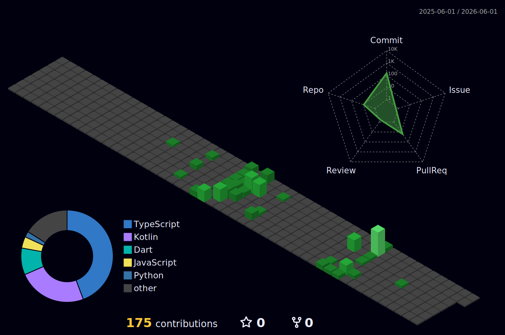

<!-- ╔══════════════════════════════════════════════════════════════════════════╗ -->
<!-- ║                                                                          ║ -->
<!-- ║   N A T H A N   O R L A N E S                                            ║ -->
<!-- ║   github.com/Fury3K                                                      ║ -->
<!-- ║                                                                          ║ -->
<!-- ╚══════════════════════════════════════════════════════════════════════════╝ -->


<div align="center">

<a href="https://git.io/typing-svg">
  
</a>

<br>

<!-- ── QUICK STATUS BAR ────────────────────────────────────────────── -->

<a href="https://njorlanes.netlify.app/"></a>


</div>

<br>

<!-- ═══════════════════════════════════════════════════════════════════════ -->
<!--                           A B O U T   M E                             -->
<!-- ═══════════════════════════════════════════════════════════════════════ -->

<div align="center">
  
</div>

<br>

<div align="center">

```
                    ╭─────────────────── system ───────────────────╮
                    │                                              │
                    │  user     : Nathan John G. Orlanes           │
                    │  role     : Full-Stack Developer              │
                    │  uptime   : since 2003                       │
                    │  shell    : java/react/next.js               │
                    │  editor   : IntelliJ IDEA                    │
                    │  theme    : dark (always)                    │
                    │                                              │
                    │  fun_fact : owns more guitars than monitors  │
                    │                                              │
                    ╰──────────────────────────────────────────────╯
```

</div>

<br>

<!-- ═══════════════════════════════════════════════════════════════════════ -->
<!--                     C U R R E N T   W O R K                           -->
<!-- ═══════════════════════════════════════════════════════════════════════ -->

<table align="center">
<tr>
<td width="50%" valign="top">

<div align="center">

### `🔭 building`

</div>

```js
const projects = {
  inventorySys: {
    desc: "Inventory management system",
    stack: ["Java", "Spring Boot", "React"],
    status: "🟢 active"
  },
  JeepMe: {
    desc: "Jeepney route & navigation",
    stack: ["Kotlin", "Jetpack Compose"],
    status: "🟡 in progress"
  }
};
```

</td>
<td width="50%" valign="top">

<div align="center">

### `🌱 leveling up`

</div>

```
   Angular      ██████████████░░░░░░  70%
   AWS          ████████████░░░░░░░░  60%
   Docker       ██████████░░░░░░░░░░  50%
   System Design████████░░░░░░░░░░░░  40%

   ┌──────────────────────────────┐
   │  🎯 2026 GOALS              │
   │  · Ship 3 production apps   │
   │  · Land a dev role          │
   │  · Master Angular           │
   │  · 365-day commit streak    │
   └──────────────────────────────┘
```

</td>
</tr>
</table>

<br>

<!-- ═══════════════════════════════════════════════════════════════════════ -->
<!--                       T E C H   S T A C K                             -->
<!-- ═══════════════════════════════════════════════════════════════════════ -->

<div align="center">
  
  <br><br>
  
</div>

<br>

<!-- Skill Icons - the beautiful version -->

<div align="center">

**`FRONTEND`**

<a href="https://skillicons.dev">
  
</a>

<br><br>

**`BACKEND`**

<a href="https://skillicons.dev">
  
</a>

<br><br>

**`DATABASE & CLOUD`**

<a href="https://skillicons.dev">
  
</a>

<br><br>

**`MOBILE`**

<a href="https://skillicons.dev">
  
</a>

<br><br>

**`LANGUAGES`**

<a href="https://skillicons.dev">
  
</a>

<br><br>

**`TOOLS & PLATFORMS`**

<a href="https://skillicons.dev">
  
</a>

</div>

<br>

<!-- ═══════════════════════════════════════════════════════════════════════ -->
<!--              D E T A I L E D   T E C H   T A B L E                    -->
<!-- ═══════════════════════════════════════════════════════════════════════ -->

<details>
<summary><b>📋 Expand for detailed tech breakdown</b></summary>
<br>

<div align="center">

| | Domain | Technologies |
|:---:|:---|:---|
| `🌐` | **Frontend** | Next.js · React · TypeScript · JavaScript · Tailwind CSS · DaisyUI · GSAP · Three.js · Framer Motion · Leaflet · HTML5 · CSS3 · Vite |
| `⚙️` | **Backend** | Java · Spring Boot · Node.js · Express.js · FastAPI · Python · PHP · SQL |
| `🗄️` | **Data** | PostgreSQL · MySQL · MongoDB · SQLite · Firebase |
| `📱` | **Mobile** | Flutter · Dart · Kotlin · Jetpack Compose · Android · Swift / Objective-C |
| `🖥️` | **Systems** | C · Python · PowerShell |
| `🤖` | **AI & Cloud** | Gemini API · AWS · Docker |
| `🔧` | **Tooling** | Git · GitHub · IntelliJ IDEA · Maven · Gradle · Postman · ESLint · Playwright · Vercel · Netlify |
| `💻` | **OS** | Windows · Linux |

</div>

</details>

<br>

<!-- ═══════════════════════════════════════════════════════════════════════ -->
<!--                       G I T H U B   S T A T S                         -->
<!-- ═══════════════════════════════════════════════════════════════════════ -->

<div align="center">
  
  <br><br>
  
</div>

<br>

<!-- GitHub Trophies -->
<div align="center">
  
</div>

<br>

<!-- Stats Cards -->
<div align="center">
  
  &nbsp;&nbsp;
  
</div>

<br>

<!-- Streak Stats -->
<div align="center">
  
</div>

<br>

<!-- Activity Graph -->
<div align="center">
  
</div>

<br>

<!-- ═══════════════════════════════════════════════════════════════════════ -->
<!--            3 D   C O N T R I B U T I O N   G R A P H                  -->
<!-- ═══════════════════════════════════════════════════════════════════════ -->

<div align="center">
  <picture>
    <source media="(prefers-color-scheme: dark)" srcset="./profile-3d-contrib/profile-night-green.svg"/>
    
  </picture>
</div>

<br>

<!-- ═══════════════════════════════════════════════════════════════════════ -->
<!--                     S N A K E   A N I M A T I O N                     -->
<!-- ═══════════════════════════════════════════════════════════════════════ -->

<div align="center">
  <picture>
    <source media="(prefers-color-scheme: dark)" srcset="https://raw.githubusercontent.com/Fury3K/Fury3K/output/github-snake-dark.svg"/>
    <source media="(prefers-color-scheme: light)" srcset="https://raw.githubusercontent.com/Fury3K/Fury3K/output/github-snake.svg"/>
    
  </picture>
</div>

<br>

<!-- ═══════════════════════════════════════════════════════════════════════ -->
<!--                    G I T H U B   M E T R I C S                        -->
<!-- ═══════════════════════════════════════════════════════════════════════ -->

<details>
<summary><b>📊 Expand for detailed GitHub Metrics</b></summary>
<br>

<div align="center">

<!-- These require the lowlighter/metrics GitHub Action -->
<!-- See setup instructions at: https://github.com/lowlighter/metrics -->


</div>

</details>

<br>

<!-- ═══════════════════════════════════════════════════════════════════════ -->
<!--                      C O N N E C T                                    -->
<!-- ═══════════════════════════════════════════════════════════════════════ -->

<div align="center">
  
  <br><br>
  
</div>

<br>

<div align="center">

<a href="mailto:n8thanjohn@gmail.com">
  
</a>
&nbsp;
<a href="https://www.linkedin.com/in/nathan-orlanes-a171332a5/">
  
</a>
&nbsp;
<a href="https://github.com/Fury3K">
  
</a>

<br><br>

<a href="https://www.facebook.com/n8thanjohn/">
  
</a>
&nbsp;
<a href="https://www.instagram.com/nj.orlanes/">
  
</a>
&nbsp;
<a href="https://njorlanes.netlify.app/">
  
</a>

</div>

<br>

<!-- ═══════════════════════════════════════════════════════════════════════ -->
<!--                        F O O T E R                                    -->
<!-- ═══════════════════════════════════════════════════════════════════════ -->

<div align="center">

```
╭──────────────────────────────────────────────────────────────────────────╮
│                                                                          │
│   "First, solve the problem. Then, write the code."                      │
│                                                        — John Johnson    │
│                                                                          │
╰──────────────────────────────────────────────────────────────────────────╯
```

<br>


<br>
<sub><code>// this pug is my spirit animal after deploying on a friday at 4:59 PM</code></sub>

<br><br>


</div>
